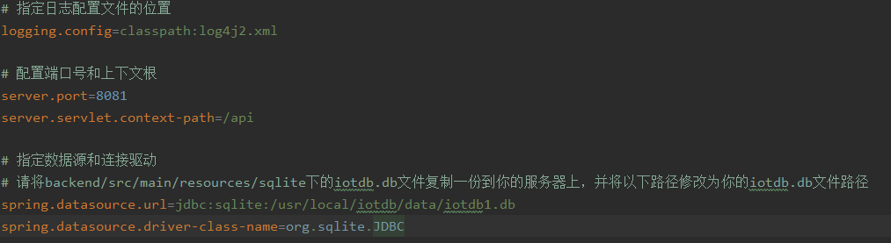
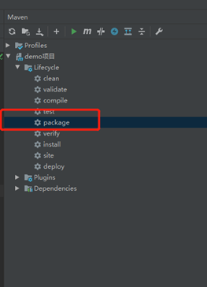
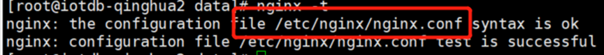
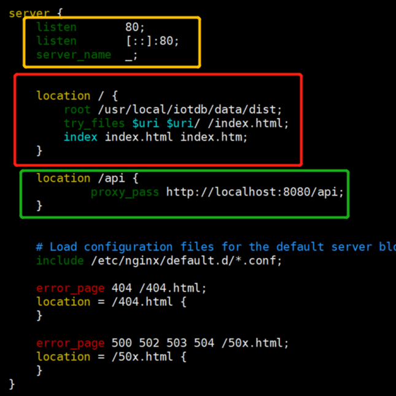

<!--

    Licensed to the Apache Software Foundation (ASF) under one
    or more contributor license agreements.  See the NOTICE file
    distributed with this work for additional information
    regarding copyright ownership.  The ASF licenses this file
    to you under the Apache License, Version 2.0 (the
    "License"); you may not use this file except in compliance
    with the License.  You may obtain a copy of the License at

        http://www.apache.org/licenses/LICENSE-2.0

    Unless required by applicable law or agreed to in writing,
    software distributed under the License is distributed on an
    "AS IS" BASIS, WITHOUT WARRANTIES OR CONDITIONS OF ANY
    KIND, either express or implied.  See the License for the
    specific language governing permissions and limitations
    under the License.

-->

# 部署流程

## 后端部署

1 通过backend/src/main/resources/application.properties指定配置文件为prod：`spring.profiles.active=prod`

在application-prod.properties中可按照自己需求修改端口号，并注意修改数据源的路径：

务必在application-prod.properties中设置jwt.sign.secret

2 打包

3 打包之后，将jar包上传到你的服务器并运行：  

首先请确定服务器上安装了sqlite3（一般Linux系统自带sqlite3，如果没有请安装）。  

通过如下命令将jar包挂载到后台运行:  

nohup java -jar xxx.jar >/dev/null 2>&1 &

至此后端部署完成。

## 前端结合后端部署

1 在服务器安装nginx服务器，命令如下:

yum install -y nginx

2 安装完成后，配置nginx的配置文件，可通过nginx -t 获取配置文件路径:

3 vim xxx.conf编辑nginx配置

配置信息如下:

其中：

- 黄框内容为监听端口号配置；  

- 红框内容以“/”映射前端资源文件，请指定为你的dist文件夹路径（dist文件夹是由前端打包产生的）；  

- 绿框以“/api”映射后台服务地址，其端口号与application-prod.properties文件中配置的端口号保持一致 。

如果你需要多个服务则需配置多个server。

4 保存配置后，命令行输入nginx启动nginx

浏览器调用服务器ip地址，端口号为黄框里指定的端口号，请求到服务器资源则部署成功。
