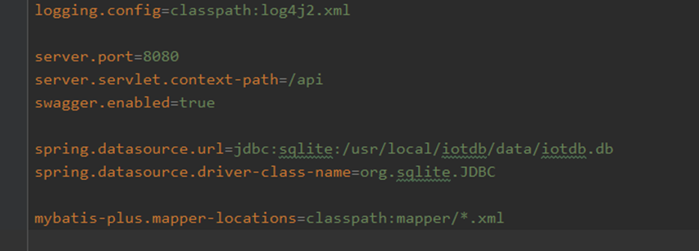
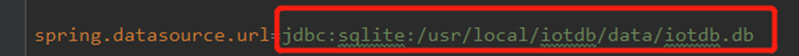
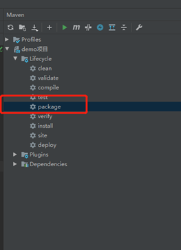
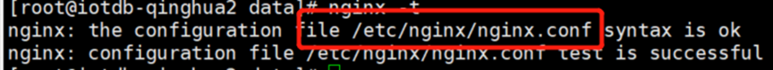
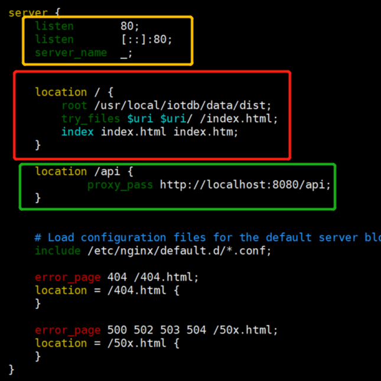

#### 部署流程

##### 1. 后端部署

1.1 指定环境配置

 

项目打包前，指定环境配置数据源iotdb.db的服务器地址信息

 

1.2 打包

1.3 打包之后，将jar包安装到指定服务器 

通过命令将jar包挂载到后台运行:

nohup java -jar xxx.jar &

后端部署完成

##### 2 .前端结合后端部署

2.1 在服务器安装nginx服务器，命令如下:

yum install -y nginx

2.2 安装完成后，配置nginx的配置文件，可通过nginx -t 获取配置文件路径:

2.3 vim xxx.conf编辑配置

配置信息如下:

 

黄框内容为监听端口号配置，红框内容以“/”映射前端资源文件，绿框以“/api”映射后台服务地址;多个服务需要配置多个server;.

2.4  保存配置后，命令行输入nginx启动nginx 

浏览器调用服务器地址，请求到服务器资源即配置成功。