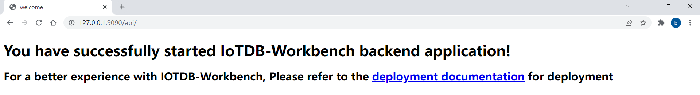

<!--

    Licensed to the Apache Software Foundation (ASF) under one
    or more contributor license agreements.  See the NOTICE file
    distributed with this work for additional information
    regarding copyright ownership.  The ASF licenses this file
    to you under the Apache License, Version 2.0 (the
    "License"); you may not use this file except in compliance
    with the License.  You may obtain a copy of the License at

        http://www.apache.org/licenses/LICENSE-2.0

    Unless required by applicable law or agreed to in writing,
    software distributed under the License is distributed on an
    "AS IS" BASIS, WITHOUT WARRANTIES OR CONDITIONS OF ANY
    KIND, either express or implied.  See the License for the
    specific language governing permissions and limitations
    under the License.

-->

# IoTDB-Workbench快速入门

该项目IoTDB-Workbench，为IoTDB的可视化监控程序。

## 支持的环境

目前支持的开发环境如下：

- Java 1.8
- Maven 3.3.9 或以上
- Gradle
- 推荐IntelliJ IDEA 2017或以上

## 目录结构说明

- doc : 文档目录，一些帮助文档
- src : 源码文件
- Dockerfile : docker镜像打包文件
- pom.xml : Maven Pom文件
- README.md : 帮助文件目录

## 使用的公用库

由于是开源软件，使用的所有库都应该是maven公有仓库能找的，满足轻量、稳定2个特性。

## 启动后端

项目提供maven、gradle两种构建工具，以maven为例启动项目：  

首先通过IntelliJ IDEA打开本项目，右键点击pom.xml，点击Add as Maven Project导入项目相关依赖。
  

导入完成后启动AdminApplication项目，启动成功后你应该能看到如下界面。  

  

接着，你可以通过浏览器访问127.0.0.1:9090/api/，看到如下页面则代表后端启动成功。
  

## 启动前端

在启动前端之前请先确保frontend/vue.config.js中配置的proxy的目标地址为后端服务的ip+端口，如图：

进入frontend目录，命令行输入`npm run serve`启动前端（具体步骤请参考[前端文档](../../frontend/README.md) ），启动成功后通过浏览器访问127.0.0.1:8080，你将进入登陆界面：

输入默认账号root、密码123456，点击登录，你就可以使用本系统了。

如果你想将本项目部署到服务器上，请参考[部署文档](deploy.md) 。