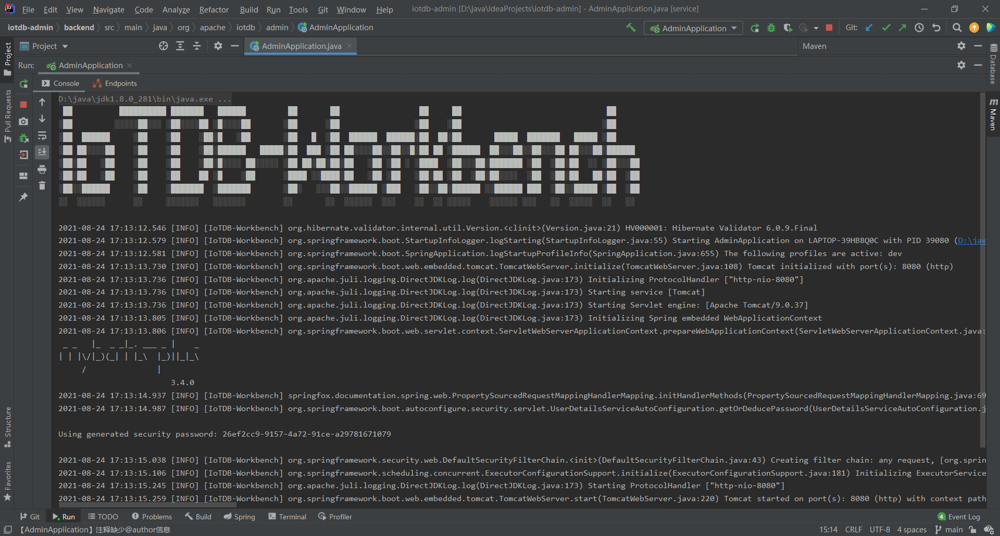

# IoTDB-Workbench快速入门

该项目IoTDB-Workbench，为IoTDB的可视化监控程序。

## 支持的环境

目前支持的开发环境如下：

- Java 1.8
- Maven 3.3.9 或以上
- Gradle
- 推荐IntelliJ IDEA 2017或以上

## 目录结构说明

- doc : 文档目录，一些帮助文档
- src : 源码文件
- Dockerfile : docker镜像打包文件
- pom.xml : Maven Pom文件
- README.md : 帮助文件目录

## 使用的公用库

由于是开源软件，使用的所有库都应该是maven公有仓库能找的，满足轻量、稳定2个特性。

## 快速启动

项目提供maven、gradle两种构建工具,以maven为例启动项目：  
首先通过IntelliJ IDEA打开本项目，右键点击pom.xml,点击Add as Maven Project导入项目相关依赖。
  
导入完成后启动AdminApplication项目，启动成功后你应该能看到如下界面。  
  
接着，你可以通过浏览器访问127.0.0.1:8080/api/，看到如下页面则代表后端启动成功。
  
具体部署步骤请参考[部署文档](deploy.md)  
本系统默认登录用户为root,密码为123456。  