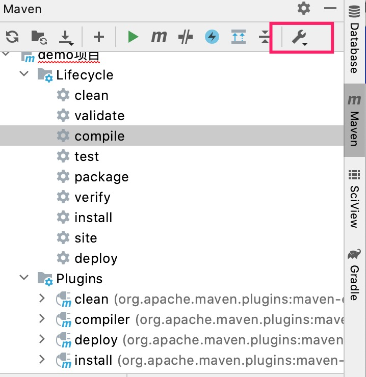
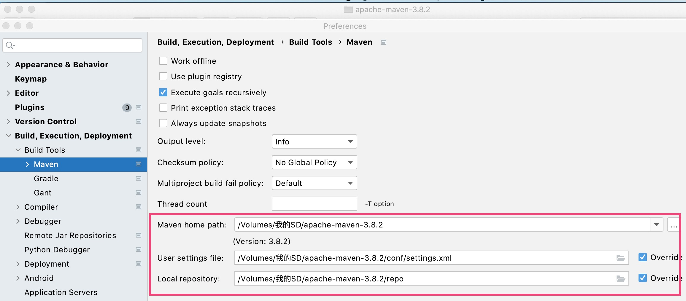

<!--

    Licensed to the Apache Software Foundation (ASF) under one
    or more contributor license agreements.  See the NOTICE file
    distributed with this work for additional information
    regarding copyright ownership.  The ASF licenses this file
    to you under the Apache License, Version 2.0 (the
    "License"); you may not use this file except in compliance
    with the License.  You may obtain a copy of the License at

        http://www.apache.org/licenses/LICENSE-2.0

    Unless required by applicable law or agreed to in writing,
    software distributed under the License is distributed on an
    "AS IS" BASIS, WITHOUT WARRANTIES OR CONDITIONS OF ANY
    KIND, either express or implied.  See the License for the
    specific language governing permissions and limitations
    under the License.

-->

# Maven 仓库配置

本文介绍如何配置Maven仓库

## Maven 安装

无论你是mac电脑还是window电脑，都可以到[Maven官网](https://archive.apache.org/dist/maven/maven-3/)直接下载，选择3.3.9或以上版本即可。

然后找一个目录解压，路径最好不要有中文，然后在Idea中引用该Maven。在下图中找到"Maven Setting"

然后按照如下内容进行配置

## Maven 配置

Maven也请使用jdk 1.8，在Idea的Build Tools->Maven->Runner中设置JRE为1.8。

尝试执行右边的Maven Projects窗口中的Lifecycle中的compile命令，看是否编译成功，如失败可以添加`-X`参数，查看错误原因。

如果出现编译错误：Error:java: 无效的目标发行版: 11

请到 Build，Execution，Deployment->Compiler->Java Compiler设置 Per-module btyecode为1.8，默认可能为11。
