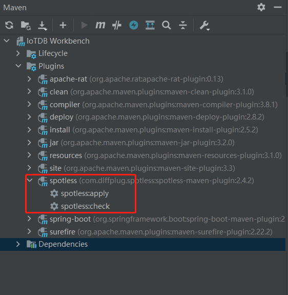

<!--

    Licensed to the Apache Software Foundation (ASF) under one
    or more contributor license agreements.  See the NOTICE file
    distributed with this work for additional information
    regarding copyright ownership.  The ASF licenses this file
    to you under the Apache License, Version 2.0 (the
    "License"); you may not use this file except in compliance
    with the License.  You may obtain a copy of the License at

        http://www.apache.org/licenses/LICENSE-2.0

    Unless required by applicable law or agreed to in writing,
    software distributed under the License is distributed on an
    "AS IS" BASIS, WITHOUT WARRANTIES OR CONDITIONS OF ANY
    KIND, either express or implied.  See the License for the
    specific language governing permissions and limitations
    under the License.

-->

# 阿里巴巴java规范checkstyle

我们使用阿里巴巴java规范泰山版（1.6.0）

需使用idea(版本2018.3+)安装插件，自动检查代码规范，具体操作步骤如下：

## 本地安装Alibaba Java Coding Guidelines

1、安装

- Mac：IntelliJ IDEA -> Preferences -> Plugins -> Installed plugins from Disk -> 选择doc目录下的code-guidelines进行安装
- Windows：File -> Settings -> Plugins -> Installed plugins from Disk -> 选择doc目录下的code-guidelines进行安装

2、重启idea

## 在线安装Alibaba Java Coding Guidelines

1、安装

- Mac：IntelliJ IDEA -> Preferences -> Plugins -> Browse repositories -> 搜索Alibaba Java Coding Guidelines -> 直接install进行在线安装
- Windows：File -> Settings -> Plugins -> Marketplace -> 搜索Alibaba Java Coding Guidelines -> 直接install进行在线安装

2、重启idea

# spotless插件规范代码

另外，我们还使用了spotless这款插件来规范代码。在backend/pom.xml中添加spotless插件：

```
<plugin>
  <groupId>com.diffplug.spotless</groupId>
  <artifactId>spotless-maven-plugin</artifactId>
  <version>${spotless.version}</version>
  <configuration>
    <java>
      <googleJavaFormat>
        <version>1.7</version>
        <style>GOOGLE</style>
      </googleJavaFormat>
      <importOrder>
        <order>org.apache.iotdb,,javax,java,\#</order>
      </importOrder>
      <removeUnusedImports/>
    </java>
    <lineEndings>UNIX</lineEndings>
  </configuration>
  <executions>
    <execution>
      <id>spotless-check</id>
      <phase>validate</phase>
      <goals>
        <goal>check</goal>
      </goals>
    </execution>
  </executions>
</plugin>
```

添加成功后我们可以看见在Maven出现了spotless插件，点击check可检查代码是否满足规范，点击apply可自动格式化代码使其满足规范。此外，在Maven打包时会自动check，如果没通过，打包就不会成功。


